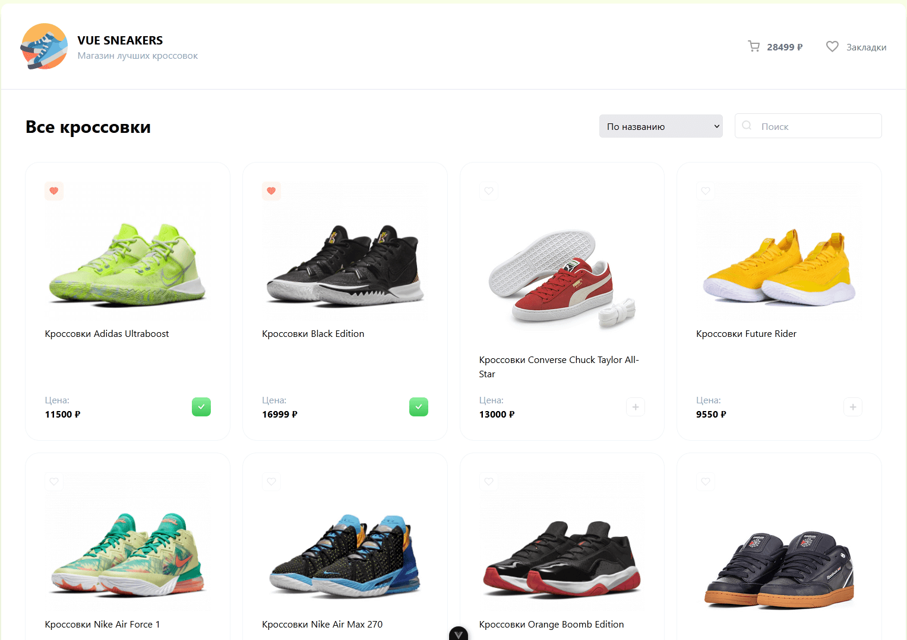

# Vue Sneakers

This template should help get you started developing with Vue 3 in Vite.


[Demo](https://deniskulik.github.io/vue-sneakers/)

## Built With

This is a vue-sneakers project built using `JavaScript`, `Vue`, `Vue Router`, `Pinia`, `axios`, `MOKKY`, `TailwindCSS` and `Vite`.

## Screenshots



## Project Setup

```sh
pnpm install
```

### Compile and Hot-Reload for Development

```sh
pnpm dev
```

### Compile and Minify for Production

```sh
pnpm build
```

### Lint with [ESLint](https://eslint.org/)

```sh
pnpm lint
```

